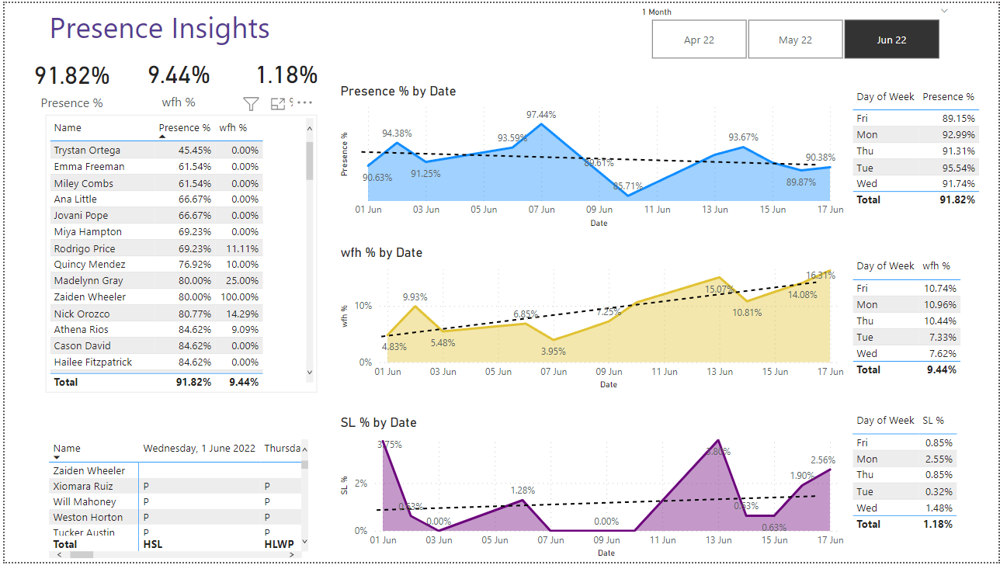

# HR Analytics with PowerBI
This repository contains one PowerBI file, HR_Analytics.pbix, that provides data visualization and insights for HR analytics. The report is designed to help HR departments and managers better understand key metrics and trends related to their employees.

## Getting Started
To view the report, you will need to have PowerBI Desktop installed on your computer.

Once you have PowerBI Desktop installed, simply download the repository and open the HR_Analytics.pbix file in PowerBI Desktop to start exploring the report.

## Sample

## Features
The report includes a number of interactive visualizations and data insights, including:

- Employee Work From Home Rate: An analysis of how many employees do Work-From-Home.
- Employee Sick Leave Rate: A trend analysis of how many employees does Sick leave.
- Employee Presence Rate: An analysis of employees turning up for work.

## Conclusion
This HR analytics report provides valuable insights into key metrics and trends related to your employees. By exploring the data visualizations and insights in this report, you can gain a deeper understanding of your employees and make data-driven decisions to improve HR practices and outcomes.

